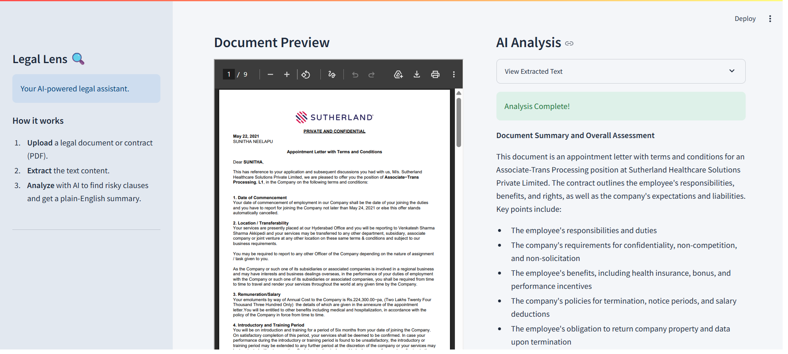
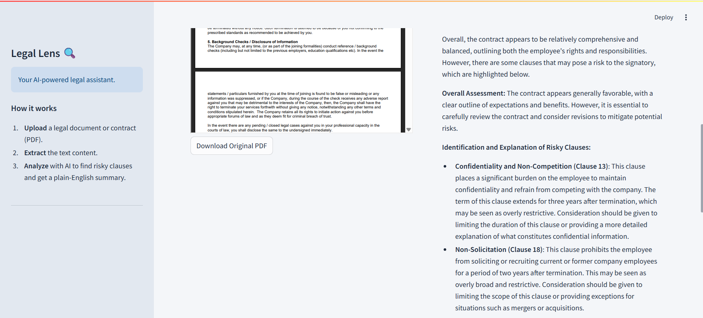
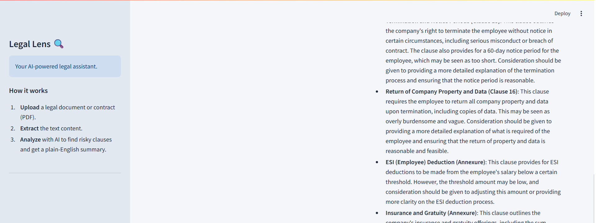
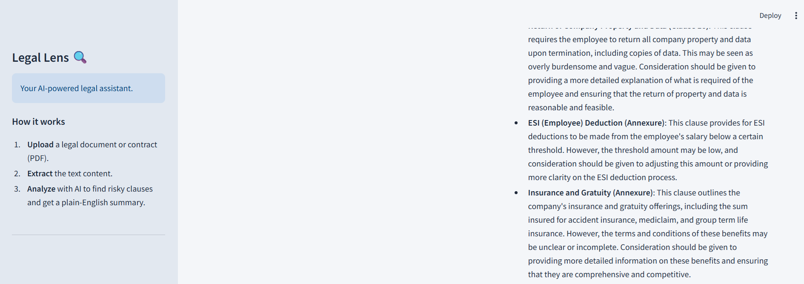

<h1 align="center">
  🔍 Legal Lens
</h1>

<p align="center">
  <strong>AI-powered legal document analysis that makes contracts understandable for everyone.</strong>
</p>

<p align="center">
  <a href="https://legal-lens-ai.streamlit.app/" target="_blank">
    
  </a>
  &nbsp;
  
  &nbsp;
  
  &nbsp;
  
</p>

---

## 📌 Project Overview

**Legal Lens** is a full-stack AI web application that demystifies complex legal documents. Users upload any PDF contract, agreement, or terms & conditions document and receive an instant, structured analysis — written in plain English — powered by Meta's **Llama 3.1** model served via the **Groq API**.

The core problem it solves: hiring a lawyer for every contract is neither practical nor affordable for most individuals and small businesses. Legal Lens acts as an always-available first-pass legal advisor, identifying risk, summarizing intent, and flagging clauses worth scrutinizing before any professional consultation.

> ⚠️ **Disclaimer:** Legal Lens is an informational tool and does not constitute legal advice. Always consult a qualified legal professional for binding decisions.

---

## 🖼️ Screenshots

| Home / Upload Interface | Risk Analysis Output |
|---|---|
|  |  |

**Full Analysis Walkthrough**





---

## ✨ Key Features

| Feature | Description |
|---|---|
| 📄 **PDF Upload & Preview** | Upload any PDF and preview it page-by-page directly in the browser |
| 📷 **Scanned PDF Support (OCR)** | Automatically detects scanned/image-based PDFs and extracts text using Tesseract OCR |
| 🤖 **AI-Powered Analysis** | Llama 3.1 (8B) via Groq's LPU for ultra-fast inference |
| 🚦 **Risk Level Badge** | Instant High / Medium / Low risk classification for the overall document |
| 📝 **Plain-English Summary** | Document purpose and key terms explained in accessible language |
| ⚠️ **Risky Clause Breakdown** | Individual risky clauses identified, explained, and flagged with recommended amendments |
| 📥 **Downloadable PDF Report** | Export a formatted analysis report as a branded PDF |
| 🔒 **Privacy-First** | No documents are stored — all processing happens in-memory |
| 🎨 **Custom Streamlit Theme** | Navy/slate professional color scheme for a polished, trustworthy UI |

---

## 🏗️ Architecture & Technical Decisions

### 1. 🚀 Groq API + Llama 3.1 (8B Instant)
- **Why Groq?** Groq's LPU (Language Processing Unit) hardware delivers inference speeds significantly faster than GPU-based alternatives. For a document analysis tool, this is critical — users expect near-instant results, not a multi-minute wait.
- **Why Llama 3.1?** Meta's Llama 3.1-8B-Instant strikes the right balance between instruction-following quality and speed. It reliably adheres to structured output prompts (e.g., `RISK_LEVEL:` prefix, bold clause headings), making it predictable for UI rendering.

### 2. 🖥️ Streamlit Frontend
- **Why Streamlit?** Enabled a fully functional, production-deployed web application in pure Python — no JavaScript required. This accelerated development significantly while keeping the entire codebase in a single language.
- A custom `.streamlit/config.toml` theme was implemented with navy (`#1f4e79`) as the primary accent to invoke trust and professionalism — a deliberate UX choice for a legal-context product.

### 3. 📑 pdfplumber + Tesseract OCR (Smart Fallback)
- **Why pdfplumber?** Legal documents commonly contain complex layouts, multi-column text, tables, and footnotes. `pdfplumber` offers the most accurate structured text extraction for these edge cases.
- **Why OCR fallback?** Many legal documents are scanned images rather than digitally-typed PDFs. The system first tries `pdfplumber` (fast); if insufficient text is extracted (<50 characters), it automatically falls back to Tesseract OCR via `PyMuPDF` + `pytesseract` — no user action required.

### 4. 🗂️ Tabbed UI with Side-by-Side Review
- The "AI Analysis" and "Document Preview" tab layout allows users to cross-reference the original contract with the AI's findings without switching windows — a key UX improvement for trust and usability.

### 5. ⚡ Streamlit Caching (`@st.cache_data`)
- Both the PDF text extraction and Groq API call are wrapped in `@st.cache_data`. This means re-runs and widget interactions don't trigger redundant API calls or re-processing, improving both speed and cost efficiency.

---

## 🗂️ Project Structure

```
Legal_Lens/
├── app.py                        # Main Streamlit application entry point
├── AI.py                         # Groq API integration & prompt engineering
├── text_extractor.py             # PDF text extraction with OCR fallback
├── requirements.txt              # Python dependencies (pinned versions)
├── packages.txt                  # System-level apt dependencies (Tesseract, Poppler)
├── offerletter.pdf               # Sample contract for live demo
│
├── .streamlit/
│   └── config.toml               # Custom Streamlit theme configuration
│
└── assets/
    ├── home.png                  # Screenshot: upload interface
    ├── result_01.png             # Screenshot: analysis output (part 1)
    ├── result_02.png             # Screenshot: analysis output (part 2)
    ├── result_03.png             # Screenshot: analysis output (part 3)
    └── result_04.png             # Screenshot: analysis output (part 4)
```

---

## 🧰 Tech Stack

| Layer | Technology |
|---|---|
| **Frontend** | Streamlit 1.41 |
| **AI / LLM** | Meta Llama 3.1 (8B Instant) via Groq API |
| **PDF Processing** | pdfplumber, Pillow |
| **OCR Engine** | Tesseract OCR (pytesseract + PyMuPDF) |
| **PDF Report Generation** | fpdf2 |
| **Environment Management** | python-dotenv |
| **Deployment** | Streamlit Community Cloud |
| **Language** | Python 3.8+ |

---

## 🚀 Getting Started (Local Setup)

### Prerequisites
- Python 3.8 or higher
- A free **Groq API Key** → [console.groq.com](https://console.groq.com/)
- **Tesseract OCR** → [Installation guide](https://github.com/UB-Mannheim/tesseract/wiki) (Windows) or `sudo apt install tesseract-ocr` (Linux/Mac)

### Installation

**1. Clone the repository:**
```bash
git clone https://github.com/gourav05052004/legal_lens.git
cd legal_lens/Code
```

**2. Install dependencies:**
```bash
pip install -r requirements.txt
```

**3. Configure environment variables:**

Create a `.env` file in the project root:
```env
GROQ_API_KEY=your_groq_api_key_here
```

**4. Run the application:**
```bash
streamlit run app.py
```

**5. Open in your browser:**
```
http://localhost:8501
```

---

## ☁️ Deployment

Legal Lens is deployed on **Streamlit Community Cloud** and is publicly accessible at:

**[https://legal-lens-ai.streamlit.app/](https://legal-lens-ai.streamlit.app/)**

The `GROQ_API_KEY` is stored as a **Streamlit Cloud Secret**, keeping it out of the repository entirely.

---

## 🔑 Environment Variables

| Variable | Required | Description |
|---|---|---|
| `GROQ_API_KEY` | ✅ Yes | Your Groq API key for LLM inference |

---

## 🧪 How It Works — End-to-End Flow

```
User uploads PDF
      │
      ▼
pdfplumber extracts raw text
      │
      ▼
Text passed to Groq API (Llama 3.1-8B-Instant)
      │
      ▼
Structured prompt requests:
  1. RISK_LEVEL classification (High / Medium / Low)
  2. Plain-English document summary
  3. Risky clause identification with explanations
      │
      ▼
Response parsed & rendered in Streamlit:
  ├── Risk badge (color-coded alert)
  ├── Document summary
  ├── Clause-by-clause breakdown
  └── Downloadable PDF report (fpdf2)
```

---

## 🤝 Contributing

Contributions, issues, and feature requests are welcome! Feel free to open an issue or submit a pull request.

1. Fork the repository
2. Create your feature branch: `git checkout -b feature/your-feature-name`
3. Commit your changes: `git commit -m 'feat: add your feature'`
4. Push to the branch: `git push origin feature/your-feature-name`
5. Open a Pull Request

---

## 📄 License

This project is open source and available under the [MIT License](LICENSE).
